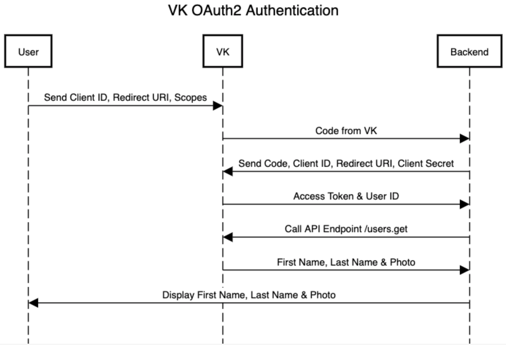
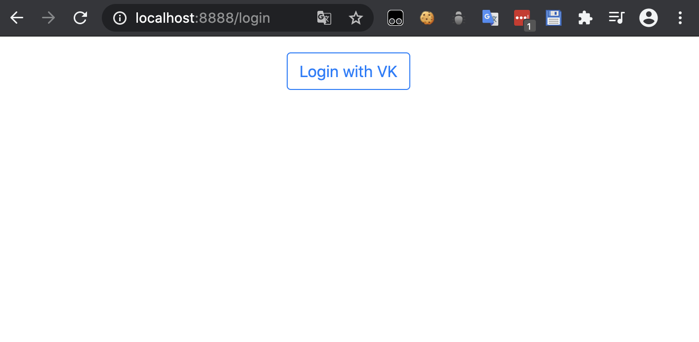
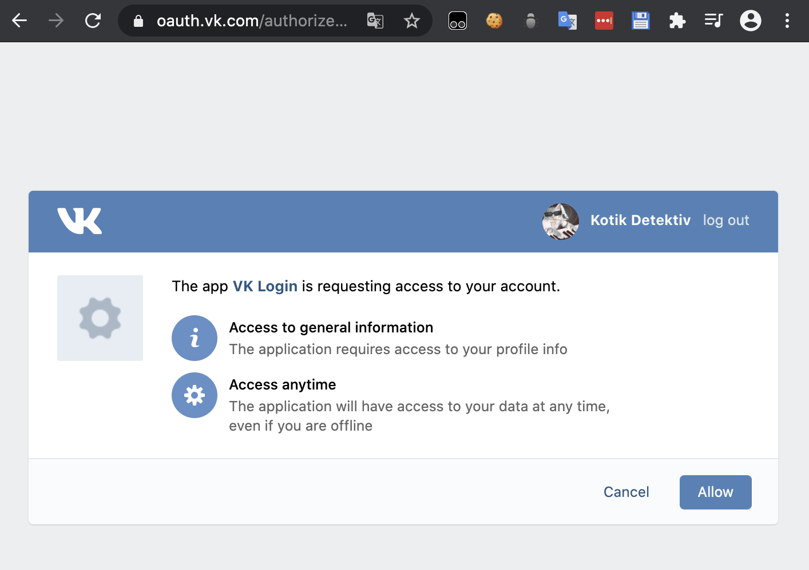
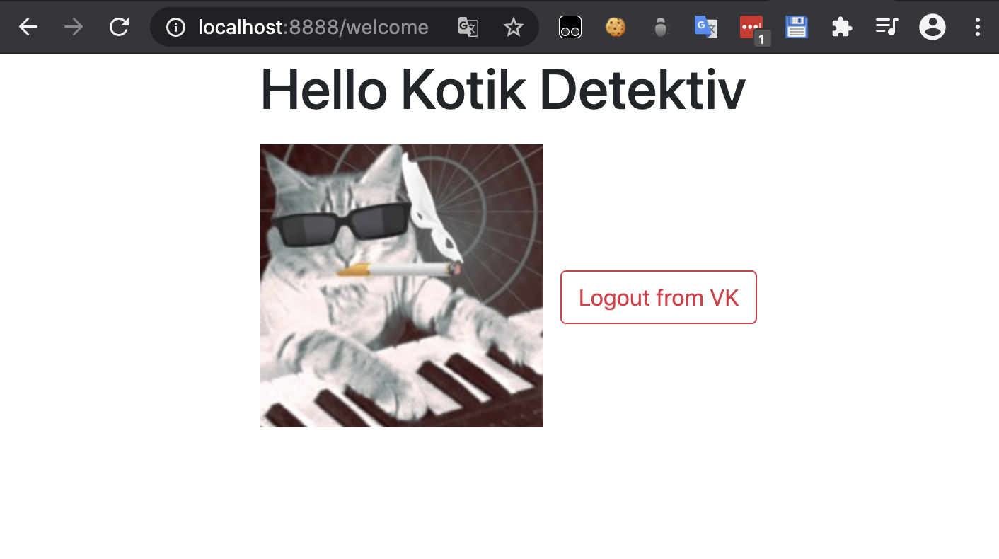

# PHP VK Login with Guzzle

I decided to learn PHP without using frameworks. This is my second project. Here I use Composer for the first time to use the dependency puzzle. With it you can make JSON requests against API servers. Here in this project I made an OAuth2 authentication in Vkontakte. This is a Russian social network.

The .env file must be edited for the app to work, more information can be found here: https://vk.com/dev/auth_sites
```dotenv
APP_ID=
REDIRECT=
SECRET_KEY=
SCOPES=offline
```

## Composer download
https://getcomposer.org/download/

## Installation
```bash
$ composer install
```

## Sequence diagram


The sequence diagram shows the OAuth2 authentication process at VK

## Login


This is the login page that leads to the app login of our VK site when you click on the button

## VK Access Page


This is the OAuth2 page of VK where permissions are checked.

## Logged in


Here all information is taken and displayed by an API request